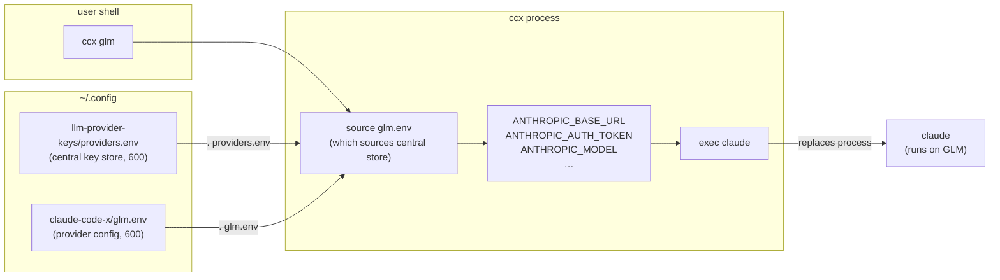

# Architecture — claude-code-x

## What & why

`ccx` routes Claude Code through alternative LLM providers (GLM/z.ai, Kimi, DeepSeek, OpenRouter, …) by injecting provider-specific environment variables at launch, then `exec`-ing `claude`. This avoids maintaining multiple `settings.json` copies that drift apart and avoids storing tokens in world-readable config.

## Reading order

1. **`bin/ccx`** — the entire runtime. Read the dispatch block at the bottom first (`case "$cmd"` → launch), then `add_provider()`, then `show_help()`. Everything else is presentation.
2. **`install.sh`** — one-shot setup: config dir, symlink, optional central key store creation.
3. **`providers.env.example`** — the two patterns for provider `.env` files (central store sourcing vs standalone key).
4. **`README.md`** — install, usage, security model.

## Components

| Path | Responsibility |
|---|---|
| `bin/ccx` | CLI entry point. Dispatches `help`, `add`, or provider launch. Sources `<provider>.env`, hardens the process, `exec claude`. |
| `install.sh` | Idempotent installer. Creates `~/.config/claude-code-x/` (700), symlinks `ccx` into `~/.local/bin`, optionally bootstraps the central key store. |
| `providers.env.example` | Template documenting both the central-store and standalone patterns for a provider `.env` file. |
| `.gitignore` | Blocks `*.env` from the repo (allows only `.example`). |
| `.claude/context/` | Project memory: decisions, anti-patterns, status log. Not runtime code. |

## How it fits

**Key invariant**: `settings.json` is never written or read by `ccx`. Claude Code reads it independently for permissions/hooks/statusline. Provider routing lives exclusively in env vars, scoped to the short-lived `ccx` process.

## Boundaries & extension points

| What | Where | Notes |
|---|---|---|
| Add a new provider | `ccx add <name>` or manually drop a `.env` in `~/.config/claude-code-x/` | Must be chmod 600. Can source the central key store or embed the token directly. |
| Change model tiers | Edit the provider `.env` (add `ANTHROPIC_DEFAULT_SONNET_MODEL`, etc.) | See `providers.env.example` for the full variable set. |
| Central key store location | `$LLM_PROVIDER_KEYS` env var | Defaults to `~/.config/llm-provider-keys/providers.env`. |
| ccx config dir location | `$CLAUDE_CODE_X_DIR` env var | Defaults to `~/.config/claude-code-x`. |
| **Do not touch** | `settings.json` — managed by `claude-setup`, not this project. | The whole point is to leave it alone. |
